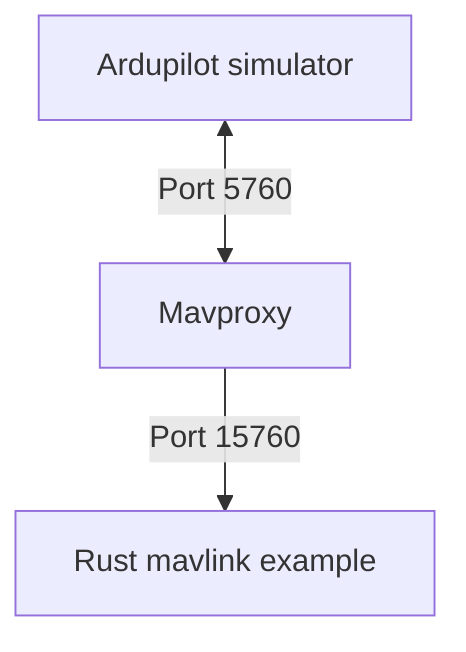

# Simple educational project to connect PC to Ardupilot with Mavlink and Rust

## Requirements
- Rust
- Build Ardupilot simulator
- Mavproxy

## Prerequisite for every examle
1. Run Ardupilot simulator
```sh
./arducopter -w -S --model + --defaults parameters/copter.parm -I0
```
2. Run Mavproxy
```sh
mavproxy.py --master tcp:127.0.0.1:5760 --out tcpin:127.0.0.1:15760
```

## Components

